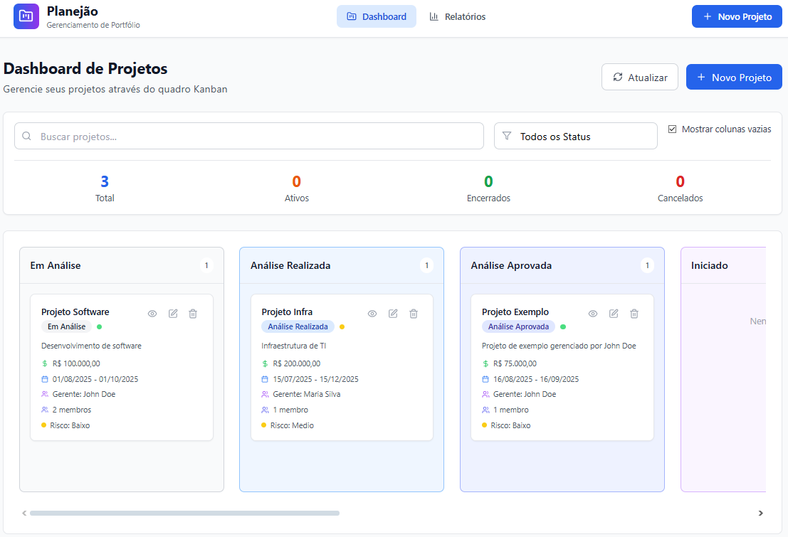
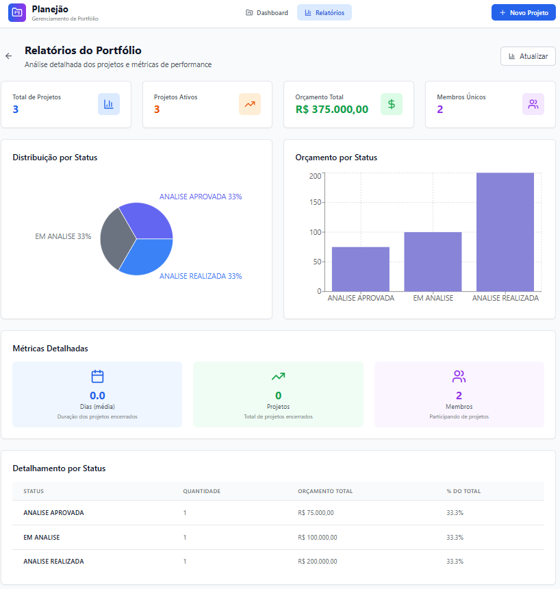
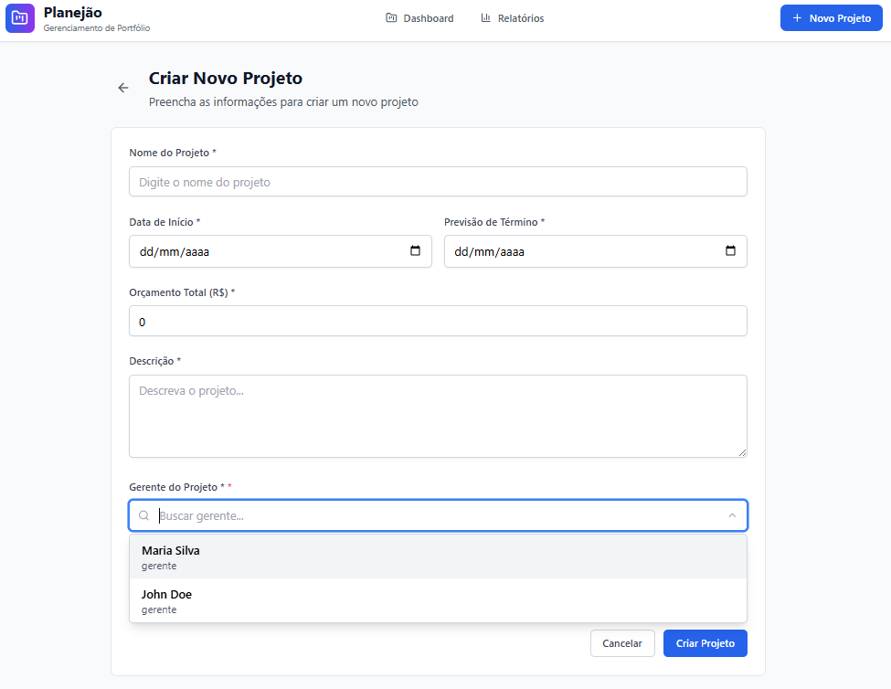

# Sistema de Gestão de Projetos - Frontend React

## Descrição do Desafio

Um sistema para gerenciar o portfólio de projetos de uma empresa. Esse sistema deverá permitir o acompanhamento completo do ciclo de vida de cada projeto, desde a análise de viabilidade até a finalização, incluindo gerenciamento de equipe, orçamento e risco.

## Screenshots

### Dashboard Principal - Quadro Kanban


O dashboard principal apresenta um quadro Kanban interativo com projetos organizados por status. Inclui:
- Filtros de busca e status
- Estatísticas resumidas (Total, Ativos, Encerrados, Cancelados)
- Cards de projeto com informações detalhadas
- Controles de visualização (mostrar/ocultar colunas vazias)

### Relatórios do Portfólio


A página de relatórios oferece análises detalhadas do portfólio:
- KPIs principais (Total de Projetos, Projetos Ativos, Orçamento Total, Membros Únicos)
- Gráficos de distribuição por status (pizza e barras)
- Métricas detalhadas (duração média, projetos encerrados, membros participantes)
- Tabela de detalhamento por status

### Criação de Novo Projeto


Formulário completo para criação de projetos com:
- Campos obrigatórios validados
- Seleção de gerente com autocomplete
- Seleção de membros da equipe
- Interface intuitiva e responsiva


## Regras de Negócio

### Status dos Projetos
- **Sequência fixa**: em análise → análise realizada → análise aprovada → iniciado → planejado → en andamento → encerrado
- **Cancelamento**: pode ser aplicado a qualquer momento
- **Transições**: devem respeitar a sequência lógica (não é permitido pular etapas)
- **Exclusão**: projetos com status iniciado, em andamento ou encerrado não podem ser excluídos

### Classificação de Risco (Calculada Dinamicamente)
- **Baixo risco**: orçamento até R$ 100.000 e prazo ≤ 3 meses
- **Médio risco**: orçamento entre R$ 100.001 e R$ 500.000 ou prazo entre 3 a 6 meses
- **Alto risco**: orçamento acima de R$ 500.000 ou prazo superior a 6 meses

### Gestão de Membros
- **Associação**: apenas membros com atribuição "funcionário" podem ser associados
- **Limite por projeto**: mínimo 1 e máximo 10 membros
- **Limite por membro**: máximo 3 projetos simultâneos (status diferente de encerrado ou cancelado)

### Validações de Projeto
- Nome obrigatório
- Datas válidas (término > início)
- Orçamento positivo
- Gerente responsável obrigatório
- Pelo menos 1 membro associado

## Tecnologias

- **React 18** com TypeScript
- **Vite** para build e desenvolvimento
- **Tailwind CSS** para estilização
- **React Router** para navegação
- **Axios** para requisições HTTP
- **React Hot Toast** para notificações
- **Recharts** para gráficos
- **Lucide React** para ícones
- **@dnd-kit** para drag & drop

## Estrutura de Pastas

```
src/
├── components/          # Componentes React
│   ├── Projects/       # Componentes de projetos
│   ├── Reports/        # Componentes de relatórios
│   └── UI/            # Componentes genéricos
├── hooks/              # Custom hooks
├── interfaces/         # Tipos TypeScript
├── pages/              # Páginas da aplicação
├── services/           # Serviços de API
└── utils/              # Utilitários
```

## Como Executar

### Pré-requisitos
1. **Node.js** versão 18 ou superior
2. **Backend Spring Boot** rodando na porta 8081
3. **Banco de dados** configurado e populado

### Instalação e Execução

```bash
# Instalar dependências
npm install

# Executar em modo desenvolvimento
npm run dev
```

O frontend estará disponível em `http://localhost:5173`

## Conexão com Backend

### Configuração do Proxy
O arquivo `vite.config.ts` está configurado para redirecionar requisições `/api` para o backend:

```typescript
proxy: {
  '/api': {
    target: 'http://localhost:8081',
    changeOrigin: true,
    secure: false,
    rewrite: (path) => path.replace(/^\/api/, ''),
  },
}
```

### Autenticação
Credenciais configuradas em `src/services/api.ts`:

```typescript
auth: {
  username: 'user',
  password: 'password',
}
```

## Endpoints Utilizados

### Projetos
- `GET /projects` - Listagem com paginação
- `POST /projects` - Criação de projetos
- `PUT /projects/{id}` - Atualização de projetos
- `DELETE /projects/{id}` - Exclusão de projetos
- `PATCH /projects/{id}/status` - Alteração de status

### Membros
- `GET /members` - Listagem de membros
- `GET /members/cargo/{cargo}` - Membros por cargo

### Relatórios
- `GET /projects/report` - Relatório do portfólio

## Funcionalidades

### Gestão de Projetos
- Listagem com paginação e filtros
- Criação de novos projetos
- Edição de projetos existentes
- Exclusão de projetos (respeitando regras de negócio)
- Alteração de status via drag & drop no Kanban
- Cálculo automático de risco

### Gestão de Membros
- Seleção de gerente com autocomplete
- Seleção de membros da equipe
- Validação de limites de associação

### Relatórios
- Relatório de portfólio com KPIs
- Estatísticas por status
- Orçamento por status
- Média de duração
- Total de membros únicos

## Fluxo de Dados

### Criação de Projeto
1. **Frontend**: Formulário com validações
2. **API**: POST `/projects` com dados do projeto
3. **Backend**: Validação de regras de negócio
4. **Resposta**: Projeto criado com dados completos

### Alteração de Status
1. **Frontend**: Drag & drop no Kanban
2. **API**: PATCH `/projects/{id}/status`
3. **Backend**: Validação de transição
4. **Resposta**: Projeto atualizado

### Relatórios
1. **Frontend**: Página de relatórios
2. **API**: GET `/projects/report`
3. **Resposta**: Dados agregados do portfólio
